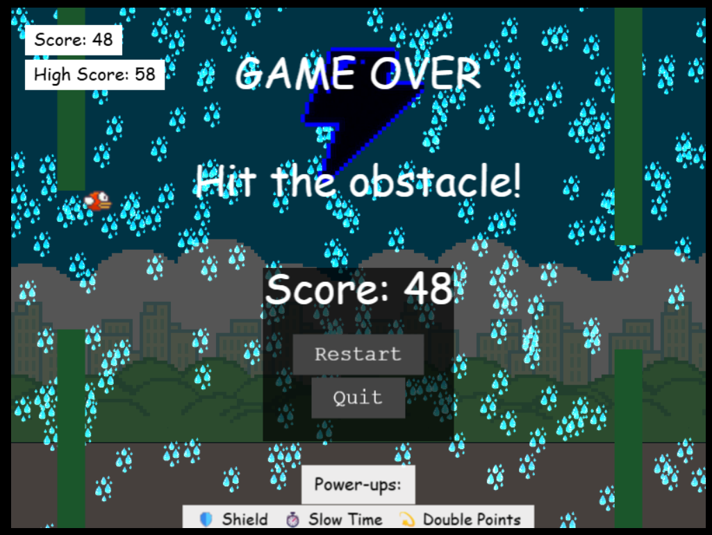

# 🐦 Flappy Bird Clone – Enhanced Edition

[](https://flappybird-advanced.vercel.app/)
[](https://phaser.io/)
[](https://github.com/nathanyap17/flappy-bird-enhanced)
[](https://opensource.org/licenses/MIT)

An **interactive, feature-rich clone** of the classic *Flappy Bird* game built with **Phaser 3**.  
This project takes the original endless-flapping mechanic and elevates it with dynamic systems, visual feedback, achievements, and modern gameplay elements — delivering a more **immersive and stimulating** experience.  

---

## 🎮 Gameplay Overview

Take control of the bird and **navigate through scrolling columns**, avoiding obstacles while collecting **power-ups** to gain temporary advantages. The game progressively gets harder, challenging your reflexes, timing, and adaptability.  

---

## ✨ Features

### 🕹️ Core Mechanics
- **Flap & Navigate** – Use the arrow keys to flap upward and move horizontally.  
- **Dynamic Obstacles** – Randomized gap positions and column spacing ensure unique runs.  
- **Progressive Difficulty** – Speed and challenge scale with your score.  

### 🌗 Dynamic Environments
- **Day/Night Cycle** – Smooth transitions between bright day and dim night every 20 seconds.  
- **Weather System** – Random weather events (clear skies, rain, wind) affecting gameplay.  

### ⚡ Power-Ups
- 🛡️ **Shield** – Temporary invulnerability to obstacles.  
- ⏱️ **Slow Time** – Halves column movement speed for precision maneuvering.  
- 💫 **Double Points** – Doubles your score gain for a limited time.  

### 🏆 Achievements
- **First Flight** – Score your very first point.  
- **High Flyer** – Score 10+ points.  
- **Survivor** – Last at least one full minute in-game.  

Achievements trigger animated overlays for instant feedback.  

### 📊 Scoring System
- **Score & High Score Tracking** – Persistent high score storage using `localStorage`.  
- **Multiplier Effects** – Adjusted by power-ups (e.g., double points).  

### 🎨 Visual & UI Enhancements
- Animated **bird sprite flapping**.  
- **Shield overlay** with countdown timer.  
- **Pause & Resume Overlay** with interactive buttons.  
- **Game Over Overlay** displaying cause of failure, score, and restart/quit options.  
- **Instruction & Power-Up Intro** shown before game start.  

---

## 🖥️ Controls

| Key | Action |
|-----|---------|
| **Space** | Start Game / Flap (before start) |
| **↑ (Up Arrow)** | Flap upward |
| **← / → (Left / Right Arrow)** | Move horizontally |
| **P** | Pause / Resume |
| **R** | Restart |

---

## 🏗️ Technical Highlights

- **Phaser 3** framework for 2D game development.  
- **Sprite animations** with error handling for missing frames.  
- **Tweens for smooth transitions** (day/night cycle, UI animations).  
- **Physics-based movement** (Arcade Physics engine).  
- **Modular scene methods** for obstacle spawning, power-ups, weather, and achievements.  
- **Robust object cleanup** to prevent memory leaks.  
- **Console logging** for debugging key events (asset loading, state transitions, achievements).  

---

## 🚀 Installation & Setup

1. Clone this repository:  
   ```bash
   git clone https://github.com/your-username/flappy-bird-enhanced.git
   cd flappy-bird-enhanced
   ```
2. Install dependencies (Phaser can be included via npm or CDN):  
   ```bash
   npm install
   ```
3. Start a local dev server (e.g., with `live-server`, `vite`, or similar):  
   ```bash
   npm run dev
   ```
4. Open the game in your browser at:  
   ```
   http://localhost:3000
   ```

---

## 📸 Screenshots

  

---

## 📌 Future Enhancements

- Additional **power-up types** (e.g., magnet, ghost mode).  
- **Leaderboard system** with online scoring.  
- **Character skins** and customization.  
- **Mobile controls** with touch support.  

---

## 👨‍💻 Author

Developed as a **final project** for the **Codédex - The Origin III: JavaScript**.  
Crafted with a balance of **advanced programming techniques** and **game design principles** to deliver an engaging re-imagination of the Flappy Bird classic.  
